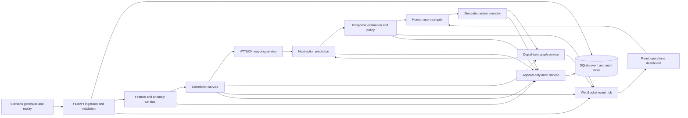
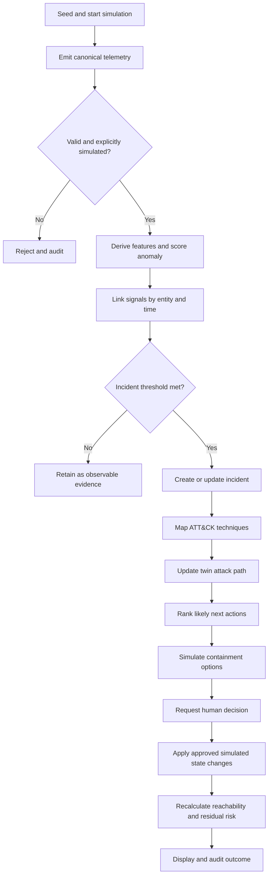
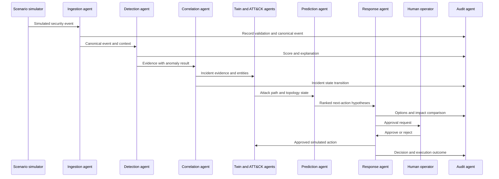
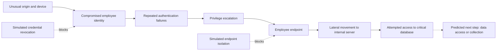
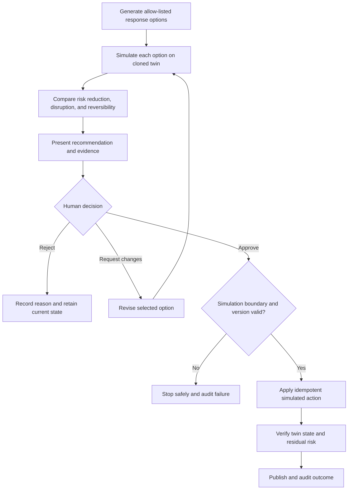

# AegisTwin Project Blueprint

## 1. Executive summary

AegisTwin is a safe cyber-resilience digital-twin prototype for critical national infrastructure (CNI). It ingests only simulated identity, endpoint, network, and database telemetry; detects behavioural anomalies; correlates weak signals into an explainable incident; maps evidence to MITRE ATT&CK; visualises attack progression; predicts likely next actions; and compares simulated containment options. A human operator remains responsible for approving material response actions. Every transformation, recommendation, approval, and simulated action is recorded in an audit trail.

The MVP proves one polished path: a compromised employee account progresses from unusual login and authentication failures through privilege escalation and lateral movement to attempted critical-database access, followed by credential revocation and endpoint isolation.

## 2. Exact problem being solved

CNI security teams receive high-volume alerts from disconnected tools. Individually weak signals are easy to dismiss, while their combined meaning may reveal a developing attack. Operators must reconstruct the sequence, understand affected assets, choose a proportionate response, and justify the decision under time pressure. The prototype demonstrates how a digital twin and bounded analytical agents can turn simulated telemetry into a coherent, inspectable incident and safely test containment without touching real systems.

## 3. Target users

- Security operations centre analysts who triage and investigate incidents.
- Incident commanders who approve containment decisions.
- CNI cyber-resilience and risk teams who assess operational impact.
- Security architects and exercise facilitators who test response playbooks.
- Auditors and governance teams who require decision provenance.

## 4. Limitations of existing approaches

- Rule-only alerting misses novel behaviour and produces isolated alerts.
- Anomaly-only systems can lack context and generate opaque scores.
- Flat dashboards do not show how identity, endpoint, network, and critical assets relate.
- Automated response can create operational risk when confidence and business impact are unclear.
- Investigation notes and response decisions are often scattered across tools.

## 5. Proposed solution

AegisTwin combines schema-validated simulated telemetry, statistical anomaly scoring, explicit correlation rules, structured ATT&CK mappings, and graph analysis. A set of narrowly scoped logical agents shares incident state through typed service contracts. The dashboard presents evidence, topology, attack path, predicted next action, containment trade-offs, and audit history. Responses update only the simulated twin and require approval when policy says human review is necessary.

## 6. MVP scope

- Generate and replay a deterministic compromised-account scenario plus benign background traffic.
- Accept simulated telemetry through an API and optional replay control.
- Score events with an Isolation Forest baseline and show contributing features.
- Correlate the scenario's weak signals into one incident using rules, time windows, and entity links.
- Map supported evidence to a curated subset of MITRE ATT&CK techniques.
- Maintain an in-memory/SQLite-backed topology and incident attack path.
- Rank a small set of next-action hypotheses using transparent transition rules.
- evaluate simulated credential revocation and endpoint isolation for efficacy and operational cost.
- Require and record human approval before material containment.
- Stream updates to a professional dashboard through WebSockets.
- Preserve a complete audit trail and expose it for review/export.

## 7. Features excluded from the MVP

- Production telemetry integrations, agents, packet capture, or live network discovery.
- Real credential revocation, endpoint isolation, exploitation, malware analysis, or offensive tooling.
- Autonomous action against any real system.
- Multi-tenant operation, enterprise SSO, production RBAC, and high availability.
- Broad ATT&CK coverage, multiple attack campaigns, online model retraining, or generative autonomous planning.
- Full asset inventory/CMDB synchronisation and production-scale streaming infrastructure.
- Claims of replacing a SIEM, SOAR, EDR, IAM platform, or human incident commander.

## 8. Primary demo scenario

1. A simulated employee account logs in from an unusual location/device.
2. Repeated failed authentications occur within a short window.
3. The same identity obtains elevated privileges.
4. A linked endpoint initiates simulated lateral movement to another host.
5. The actor attempts access to a critical database.
6. AegisTwin correlates the chain, maps techniques, updates the twin, and predicts likely database collection/access.
7. The response evaluator compares no action, credential revocation, endpoint isolation, and the combined option.
8. An operator approves the recommended combined containment.
9. The simulator marks the account revoked and endpoint isolated; no external command is executed.

## 9. Complete system workflow

1. Scenario generator emits canonical simulated events with deterministic timestamps and IDs.
2. Ingestion validates provenance, schema, and `simulation=true`, then persists raw events.
3. Feature extraction derives event, identity, endpoint, frequency, rarity, and time-window features.
4. The anomaly service produces a score and stores model version and feature contributions.
5. The correlator links signals by identity, endpoint, target, and time window and updates an incident.
6. ATT&CK mapping attaches curated techniques with evidence and confidence.
7. The twin service mutates its simulated graph and records observed attack-path edges.
8. The prediction service ranks allowed next steps from current state and topology.
9. The response service simulates candidate effects and presents efficacy, disruption, reversibility, and confidence.
10. Policy routes material actions to a human approval gate.
11. Approved actions change only simulated entity state.
12. WebSocket messages refresh the dashboard; every stage appends an audit record.

## 10. Agent responsibilities

Agents are logical, bounded application services rather than unconstrained autonomous processes.

| Agent | Responsibility | Inputs | Outputs | Guardrail |
|---|---|---|---|---|
| Ingestion agent | Validate and normalise telemetry | Simulated event | Canonical event/rejection | Rejects missing simulation marker |
| Detection agent | Build features and score anomalies | Canonical event/context | Score, threshold, explanation | Versioned offline model only |
| Correlation agent | Combine evidence into incidents | Events and scores | Incident state/evidence links | Explicit rules and time windows |
| ATT&CK analyst | Map evidence to curated techniques | Incident evidence | Technique mappings | No procedural attack instructions |
| Twin agent | Maintain topology and attack path | Entities, relationships, incident | Versioned graph state | Simulated entities only |
| Prediction agent | Rank likely next actions | Incident/twin state | Ranked hypotheses | Closed allow-list with rationale |
| Response agent | Compare and simulate containment | Incident, hypotheses, policy | Options and recommendation | No real-world adapters |
| Audit agent | Record provenance and decisions | Domain events | Append-only audit entries | Immutable application API |

## 11. Functional requirements

- **FR-01:** Accept canonical simulated security events and reject events not explicitly marked simulated.
- **FR-02:** Replay the primary scenario deterministically at selectable speed.
- **FR-03:** Persist raw events and validation failures without silently altering evidence.
- **FR-04:** Score supported events and expose model version, threshold, and feature explanation.
- **FR-05:** Correlate signals by entities and configurable time windows into an incident timeline.
- **FR-06:** Attach evidence-backed mappings from the curated ATT&CK catalogue.
- **FR-07:** Display assets, identities, relationships, status, and attack-path progression.
- **FR-08:** Rank likely next actions with confidence and supporting rationale.
- **FR-09:** Simulate containment options and estimate security benefit and operational impact.
- **FR-10:** Enforce approval policy before simulated material actions.
- **FR-11:** Simulate credential revocation and endpoint isolation idempotently.
- **FR-12:** Stream event, incident, twin, prediction, approval, and response changes.
- **FR-13:** Provide incident detail, evidence, model explanation, and audit timeline APIs.
- **FR-14:** Reset demo state without affecting anything outside the application database.

## 12. Non-functional requirements

- Deterministic demo execution from a fixed scenario seed.
- P95 API response under 500 ms for normal dashboard reads on a developer laptop.
- Event-to-dashboard update under 2 seconds at the planned demo rate (at least 10 events/second).
- Typed OpenAPI and frontend contracts with backwards-compatible versioning during the MVP.
- Repeatable database migrations, structured logs, health checks, and documented configuration.
- Accessible keyboard navigation, readable contrast, and responsive layouts at laptop resolutions.
- Unit, integration, contract, WebSocket, and end-to-end test coverage of the critical path.
- Explainability and audit records for every model, correlation, prediction, and response decision.
- No secrets in source control; configuration comes from environment variables with safe defaults.

## 13. Safety boundaries

- All events and entities must belong to a seeded simulation workspace and carry `simulation=true`.
- The backend exposes no arbitrary command, shell, network-scan, exploit, malware, or credential-capture capability.
- Response actions are an allow-list of state transitions in the twin database; there are no production adapters.
- Hostnames, IP addresses, identities, and credentials are synthetic and use documentation-safe ranges/domains.
- The UI labels all data and actions as simulated and shows a persistent safety banner.
- Material actions require explicit human approval and are idempotent, reversible in the simulation, and audited.
- Model outputs are advisory; confidence is never represented as certainty.
- Logs redact configuration secrets and avoid storing unnecessary personal data.

## 14. Technology stack and justification

| Layer | Choice | Justification |
|---|---|---|
| Web application | React, TypeScript, Vite | Fast iteration, typed UI contracts, strong ecosystem, simple hackathon build |
| UI system | Tailwind CSS, shadcn/ui, Lucide | Accessible primitives and a restrained, consistent dashboard |
| Navigation/data | React Router, Axios | Clear route boundaries and centralised typed API client/interceptors |
| Topology | React Flow | Interactive graph nodes, edges, selection, and viewport controls |
| Analytics | Recharts | Lightweight React-native charts for scores and timelines |
| API | Python 3.11+, FastAPI | Typed async APIs, automatic OpenAPI, WebSocket support |
| Validation/config | Pydantic and Pydantic Settings | Shared validation idioms and environment-based configuration |
| Persistence | SQLAlchemy 2, SQLite | Explicit ORM/data layer and zero-service prototype database |
| Analytics | scikit-learn Isolation Forest | Proven unsupervised baseline for mixed behavioural rarity signals |
| Graph analysis | NetworkX | Straightforward path, neighbourhood, and reachability calculations |
| Tests | pytest plus frontend unit/E2E tools selected in Phase 2 | Mature backend testing and room to align frontend tooling with scaffold |

## 15. High-level system architecture



## 16. Frontend architecture

- **Application shell:** route layout, safety banner, global incident status, error boundary.
- **Feature routes:** overview, live telemetry, incident investigation, digital twin, response centre, audit trail, and demo controls.
- **Typed API layer:** generated or hand-maintained TypeScript DTOs matched to OpenAPI; one Axios client.
- **Server state:** query/cache library choice remains a Phase 2 decision; WebSocket messages invalidate or patch cached resources.
- **Presentation:** shadcn/ui primitives and Tailwind design tokens; domain components remain independent from transport logic.
- **Visualisation:** React Flow receives a view model from twin selectors; Recharts receives prepared series rather than raw API payloads.
- **State separation:** ephemeral UI state stays local; incident truth remains server-owned.

## 17. Backend architecture

Use a modular monolith for prototype speed while preserving service boundaries:

- API routers validate transport concerns and call application services.
- Application services implement ingestion, detection, correlation, mapping, prediction, response, and audit use cases.
- Domain models represent events, incidents, evidence, twin entities, approvals, and actions without framework coupling.
- Repository interfaces isolate SQLAlchemy persistence.
- A synchronous in-process domain-event dispatcher drives the MVP pipeline; interfaces permit a future message broker.
- WebSocket connections subscribe to typed domain-event envelopes.
- Alembic-managed schema migrations are proposed for Phase 2.

## 18. AI pipeline

1. Validate and normalise categorical and numerical event fields.
2. Derive features such as failure count, source rarity, time-of-day deviation, new-device flag, privilege delta, target criticality, and lateral-hop count.
3. Transform features using a fitted, versioned preprocessing pipeline.
4. Score with Isolation Forest trained only on seeded benign simulation data.
5. Calibrate a demo threshold using validation scenarios; do not interpret raw score as probability.
6. Produce an explanation containing feature values, deviations from baseline, triggered rules, model version, and threshold.
7. Combine score with deterministic correlation rules; the model never directly executes a response.
8. Store inputs and outputs so a decision can be replayed.

## 19. Digital-twin architecture

The twin is a versioned property graph represented in persistence and materialised into NetworkX for calculations. Node types include identity, endpoint, server, database, network zone, and service. Edge types include authenticated-from, connected-to, member-of, accessed, hosts, and trusts. Static seeded topology is separated from dynamic security state. Incident overlays identify observed and predicted paths without mutating base relationships. Response simulations operate on cloned graph state, compare reachability before and after action, then apply approved changes only to the simulation state.

## 20. Response-orchestration design

- Candidate actions are defined in a closed registry with preconditions, simulated effects, reversibility, and approval policy.
- The evaluator clones current twin state, applies each candidate, and measures critical-asset reachability, disrupted benign dependencies, coverage, and residual risk.
- The recommender ranks options with an explicit weighted score and returns a rationale; weights are configuration, not learned policy.
- Credential revocation and endpoint isolation require approval in the MVP.
- Approval records actor label, decision, timestamp, optional reason, incident version, and selected option.
- The executor checks the simulation boundary and idempotency key before updating twin state.

## 21. Explainability and audit design

Every decision produces a structured explanation: evidence IDs, derived features, rules fired, model/configuration version, confidence/score semantics, candidate alternatives, and the reason for selection. Audit entries are append-only through the application interface and form a hash-linked sequence per incident (`previous_hash`, `entry_hash`) to make accidental alteration evident. The audit UI presents a human-readable timeline and raw structured detail. The prototype provides tamper evidence, not a production-grade immutable ledger.

## 22. Database entities

| Entity | Purpose and key relationships |
|---|---|
| `simulation_runs` | Seed, scenario, clock, state; parent of generated data |
| `security_events` | Canonical raw/normalised event, source time, entity references |
| `feature_vectors` | Versioned derived features for an event/entity window |
| `anomaly_results` | Score, threshold, classification, model version, explanation |
| `incidents` | Status, severity, confidence, first/last seen, current version |
| `incident_evidence` | Many-to-many link between incidents and events with role/weight |
| `attack_techniques` | Curated ATT&CK technique metadata and local catalogue version |
| `incident_techniques` | Technique mapping, confidence, rule, supporting evidence |
| `twin_nodes` | Typed simulated entities, criticality, dynamic status, run ID |
| `twin_edges` | Typed relationships with source, target, and validity |
| `attack_steps` | Ordered observed/predicted incident path elements |
| `predictions` | Ranked next actions, confidence, rationale, model/rule version |
| `response_options` | Candidate action plan and simulated impact metrics |
| `approval_requests` | Requested option, policy, status, incident version |
| `response_actions` | Idempotent simulated execution and before/after state |
| `audit_entries` | Actor, action, object, structured details, hash chain |

## 23. Preliminary API endpoints

All endpoints are versioned under `/api/v1`.

| Method and path | Purpose |
|---|---|
| `GET /health` | Liveness/readiness summary |
| `POST /simulation/runs` | Start a seeded scenario run |
| `POST /simulation/runs/{id}/control` | Pause, resume, step, reset, or change replay speed |
| `GET /simulation/runs/{id}` | Run status and clock |
| `POST /events` | Ingest one simulated event |
| `POST /events/batch` | Ingest a bounded simulated batch |
| `GET /events` | Filter/paginate event history |
| `GET /events/{id}/analysis` | Features, anomaly result, and explanation |
| `GET /incidents` | Filter/paginate incidents |
| `GET /incidents/{id}` | Incident summary, timeline, evidence, mappings |
| `GET /incidents/{id}/predictions` | Ranked next-action hypotheses |
| `POST /incidents/{id}/response-options/evaluate` | Simulate candidate containment options |
| `POST /incidents/{id}/approval-requests` | Request approval for an option |
| `POST /approval-requests/{id}/decision` | Approve or reject with optimistic version check |
| `POST /response-actions/{id}/execute` | Execute an approved simulated action idempotently |
| `GET /twin` | Current topology snapshot |
| `GET /twin/incidents/{id}/path` | Observed and predicted attack path |
| `GET /audit` | Filter/paginate audit entries |
| `GET /audit/export` | Export structured audit data for the demo |
| `WS /ws/runs/{run_id}` | Stream typed simulation and incident updates |

## 24. WebSocket event types

Every envelope contains `type`, `schema_version`, `message_id`, `occurred_at`, `simulation_run_id`, `correlation_id`, and `payload`.

- `simulation.run.updated`
- `telemetry.event.ingested`
- `anomaly.result.created`
- `incident.created`
- `incident.updated`
- `incident.evidence.added`
- `attack.mapping.updated`
- `twin.snapshot.updated`
- `attack.path.updated`
- `prediction.updated`
- `response.options.evaluated`
- `approval.requested`
- `approval.decided`
- `response.action.executed`
- `audit.entry.created`
- `system.error` (sanitised, recoverable client message)

Clients reconnect with the last seen message ID and then refresh authoritative REST snapshots; durable replay is not promised for the MVP.

## 25. Proposed security-event schema

```json
{
  "schema_version": "1.0",
  "event_id": "evt-000123",
  "simulation": true,
  "simulation_run_id": "run-demo-001",
  "occurred_at": "2026-07-21T10:15:30Z",
  "received_at": "2026-07-21T10:15:31Z",
  "event_type": "authentication.failure",
  "source": {"product": "aegistwin-simulator", "component": "identity"},
  "actor": {"identity_id": "id-alex-01", "role": "employee"},
  "origin": {"endpoint_id": "ep-laptop-07", "ip": "192.0.2.17", "zone": "remote"},
  "target": {"entity_id": "svc-auth-01", "entity_type": "service", "criticality": "medium"},
  "action": "authenticate",
  "outcome": "failure",
  "severity": "low",
  "attributes": {"reason": "invalid_password", "device_known": false, "country_code": "ZZ"},
  "trace": {"correlation_id": "corr-001", "parent_event_id": null},
  "labels": ["primary-scenario"]
}
```

Allowed `event_type` values for the MVP include `authentication.success`, `authentication.failure`, `identity.privilege_changed`, `network.lateral_connection`, `database.access_attempt`, and `response.state_changed`. `attributes` is type-specific but validated by a discriminated schema. IPs use documentation ranges and identities are synthetic.

## 26. Repository folder structure

```text
AegisTwin/
|-- docs/
|   |-- PROJECT_BLUEPRINT.md
|   |-- BUILD_CHECKLIST.md
|   `-- DECISIONS.md
|-- frontend/                         # Phase 2
|   |-- src/
|   |   |-- api/
|   |   |-- app/
|   |   |-- components/
|   |   |-- features/
|   |   |-- hooks/
|   |   |-- routes/
|   |   |-- styles/
|   |   `-- types/
|   `-- tests/
|-- backend/                          # Phase 2
|   |-- app/
|   |   |-- api/
|   |   |-- application/
|   |   |-- core/
|   |   |-- domain/
|   |   |-- infrastructure/
|   |   |-- models/
|   |   `-- schemas/
|   |-- migrations/
|   `-- tests/
|-- simulator/                        # Phase 3
|   |-- scenarios/
|   `-- fixtures/
|-- shared/                           # Contracts and curated ATT&CK data
|-- scripts/                          # Safe developer/demo helpers
|-- .env.example
|-- .gitignore
|-- LICENSE
`-- README.md
```

Only `docs/` exists after this planning phase; the remaining paths are proposed.

## 27. End-to-end incident workflow



## 28. Multi-agent interaction



## 29. Digital-twin attack path



## 30. Human approval and response flow



## 31. Testing strategy

- Unit tests for schema validation, feature derivation, rules, scoring adapters, graph operations, ranking, policy, and idempotency.
- Property/boundary tests for time windows, duplicate/out-of-order events, invalid simulation markers, and graph invariants.
- Repository tests against temporary SQLite databases and migration upgrade tests.
- API contract tests using FastAPI's test client and shared fixtures.
- WebSocket tests for envelope shape, ordering assumptions, reconnect refresh, and disconnection handling.
- Frontend component tests for critical incident, twin, approval, and audit states.
- End-to-end browser test for the complete primary demo, including rejection and approval branches.
- Golden scenario tests asserting known correlations, ATT&CK mappings, predictions, and containment effects.
- Safety tests proving unsupported actions and non-simulated events are rejected and no network/command adapter exists.
- Performance smoke test at and above the target demo event rate.

## 32. Evaluation metrics

| Area | Metric | MVP target |
|---|---|---|
| Detection | Recall on seeded malicious scenario events | At least 90% |
| Detection | False-positive rate on seeded benign events | At most 10% |
| Correlation | Primary scenario incident-chain precision/recall | 100% on golden fixture |
| Mapping | Technique mapping accuracy against curated expected labels | At least 90% |
| Prediction | Correct next action within top 3 on scenario checkpoints | 100% on primary scenario |
| Response | Critical-database reachability reduction after combined action | 100% in twin fixture |
| Latency | Event-to-dashboard P95 | Under 2 seconds at 10 events/second |
| Explainability | Decisions with evidence, rationale, and version | 100% |
| Audit | Required lifecycle transitions represented | 100% |
| Reliability | Primary demo completion across repeated seeded runs | 10 of 10 |

These are prototype validation targets on synthetic fixtures, not claims of real-world detection effectiveness.

## 33. Deployment approach

For development, run the React/Vite frontend and FastAPI backend as separate local processes with one SQLite file and seeded scenario data. For the demo, package them as separate containers orchestrated with Docker Compose, bind only required ports, use environment-driven configuration, include health checks, and mount a disposable data volume. Build static frontend assets for a production-style server or lightweight reverse proxy. No external telemetry or response connection is deployed. CI should lint, type-check, test, build, run migrations on a temporary database, and scan committed configuration for secrets.

## 34. Risks and mitigations

| Risk | Impact | Mitigation |
|---|---|---|
| Synthetic model appears smarter than evidence supports | Loss of credibility | Show score semantics, rules, versions, limits, and fixture-based metrics |
| Demo chain fails due to timing/state nondeterminism | Broken presentation | Seed IDs/clock, offer step mode, golden E2E test, reset endpoint |
| Weak-signal correlation produces noisy incidents | Confusing output | Start with one scenario, explicit windows/entity links, tune on benign fixtures |
| Digital-twin graph becomes visually or computationally complex | Poor usability/performance | Small typed topology, server-side view models, path-focused filtering |
| Automated response implies unsafe real-world capability | Safety/governance concern | Simulation marker, allow-list, approval gate, no external adapters, safety tests |
| SQLite write contention under streamed updates | Dropped/delayed state | Bounded demo rate, short transactions, WAL evaluation, single process |
| ATT&CK mappings are incorrect or stale | Misleading explanation | Curated versioned subset, evidence-backed tests, cite source version in UI |
| Audit claims exceed prototype guarantees | Governance risk | State that hash linking is tamper-evident, not immutable storage |

## 35. Assumptions

1. The repository was empty at planning time.
2. The hackathon demo runs on a single developer machine or a small container host.
3. All telemetry, identities, hosts, IP addresses, database records, and response effects are synthetic.
4. One simulation run is actively demonstrated at a time; multi-run storage is supported for repeatability, not concurrency scale.
5. Seeded benign data is sufficient to fit and demonstrate the baseline, but not to claim real-world validity.
6. The ATT&CK catalogue is a small, versioned, manually reviewed subset relevant to the scenario.
7. Authentication for demo users may be mocked; approvals still require an explicit operator identity label.
8. SQLite is sufficient for the planned rate and modular persistence allows later replacement.
9. A modular monolith is preferable to distributed services within hackathon constraints.
10. WebSocket delivery is best-effort; REST snapshots remain authoritative after reconnect.
11. Response scoring weights and approval policies are explicit configuration owned by the prototype team.
12. Browser support targets current Chromium-based browsers at laptop resolution.
13. Open-source licence files and notices will be added and preserved when dependencies/assets are introduced in Phase 2.

## 36. Unresolved decisions

- Exact frontend server-state and test libraries after the Vite scaffold is selected.
- Whether Alembic is introduced immediately in Phase 2 or with the first persistent domain model.
- Exact curated ATT&CK technique IDs and catalogue version for the scenario.
- Isolation Forest training set size, contamination parameter, feature scaling, and threshold calibration.
- Correlation window durations and severity/confidence scoring weights.
- The response-option ranking weights and which actions, if any, could be auto-approved in later versions.
- Whether the demo deployment uses a reverse proxy or FastAPI serves built frontend assets.
- Audit export format beyond JSON (for example CSV or a signed report).

## 37. Acceptance criteria for the finished prototype

- A fresh setup can start the documented local or containerised demo without hidden manual data edits.
- The seeded scenario replays from unusual login through attempted critical-database access.
- Benign background events are visible and do not prevent the correct incident chain from forming.
- Each important event has a score, threshold interpretation, feature explanation, and version metadata.
- One incident timeline correlates the required stages with inspectable evidence.
- Relevant curated ATT&CK techniques appear with confidence and supporting events.
- The React Flow twin clearly distinguishes normal topology, observed path, predicted step, critical asset, and containment state.
- At least one likely next action is ranked with a transparent rationale and uncertainty.
- Response options show expected risk reduction, disruption, reversibility, and policy requirement.
- Credential revocation and endpoint isolation cannot execute without recorded approval and affect only simulated state.
- The combined approved response prevents the simulated path from reaching the critical database.
- The audit trail covers ingestion, analysis, correlation, mapping, prediction, recommendation, approval, and execution.
- Invalid/non-simulated events and unsupported response actions are rejected and audited.
- Critical automated tests pass, including the golden scenario and safety tests.
- The UI is coherent at demo resolution, labels simulation status persistently, and recovers from a WebSocket reconnect.
- The measured prototype meets the stated latency and repeatability targets on the demo machine.
