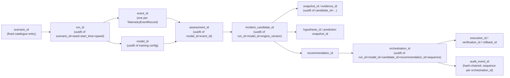
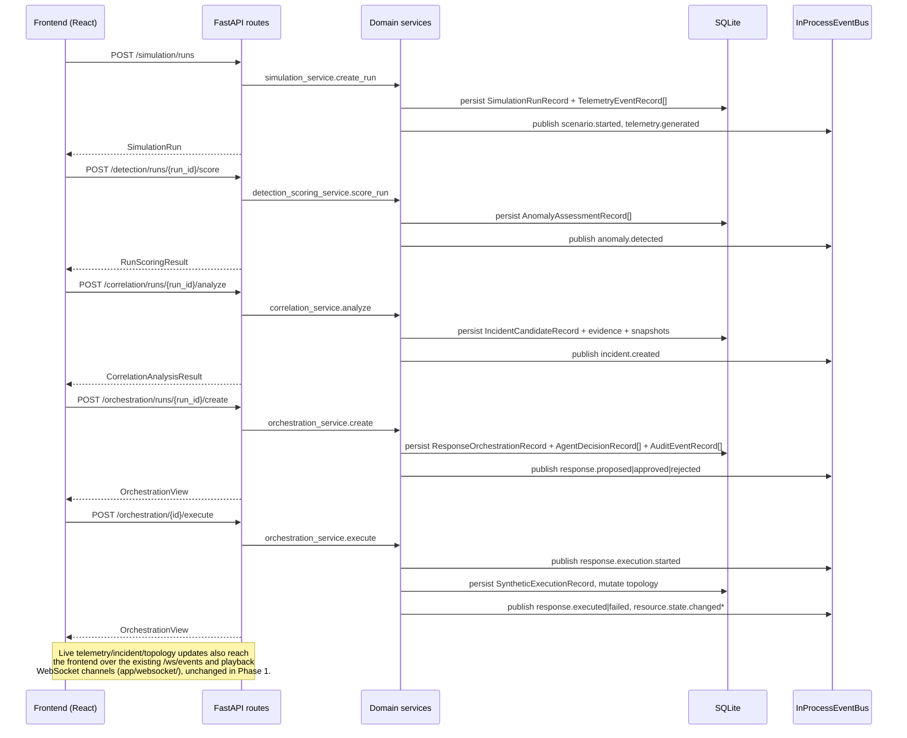

# Data Flow and Correlation Model

## Identifier lineage

Every identifier in this chain is a **deterministic** id (`uuid5` of its
inputs, or a hash chain for audit events), not a random `uuid4`. This was
already true in the Phase 0 baseline — Phase 1 did not change any ID
scheme — and it is what makes the whole pipeline naturally idempotent: the
same request, replayed with the same inputs, always resolves to the same
row rather than creating a duplicate (see "Idempotency" below).

## `run_id` as the correlation backbone

`run_id` is the one identifier present at every stage from telemetry
through response execution and verification. Phase 1 formalizes this by
setting `DomainEvent.correlation_id = run_id` (or the orchestration
record's `simulation_run_id`) on every published event — see
`docs/architecture/EVENT_MODEL.md`. `incident_id` (the `incident_candidate_id`)
becomes available from `incident.created` onward and is carried forward
into every `response.*` event, so a reader can reconstruct "which incident
led to which response decision" without re-querying the database, purely
from the event stream.

`tests/test_correlation_identity.py` is the executable proof of this: it
runs a real request sequence (scenario → score → correlate → predict →
respond → orchestrate) against a live FastAPI app with an isolated event
bus, and asserts that `run_id` is identical across every event type and
that `incident_id` on `response.*` events matches the `incident_candidate_id`
`correlation_service.analyze` returned.

## Request/response data flow (unchanged from Phase 0, now event-annotated)

## The Digital Twin run-context investigation (Phase 1 finding, not fixed)

Phase 0 observed that after a hard page reload, the Digital Twin page lost
its "active run" context and the applied-execution overlay did not
visually re-associate with the topology view. Phase 1 investigated the
root cause:

- **Backend**: already has well-defined semantics. `run_id` is a real,
  fetchable, persisted identifier (`GET /simulation/runs/{run_id}`); the
  topology mutation from a response execution is tied to a specific
  `orchestration_id` and a list of changed node/edge ids
  (`SyntheticExecutionRecord.changed_node_ids_json`); and
  `GET /topology/runs/{run_id}/state` exists specifically to reconstruct a
  run's topology state from nothing but its `run_id`. No API contract gap
  or missing identifier was found.
- **Frontend**: `frontend/src/pages/DigitalTwinPage.tsx` holds `runId`,
  `modelId`, and the rest of the page's selection state in plain
  `useState` (component-local, in-memory only) fed by
  `SimulationPlaybackProvider`'s React context — also in-memory only.
  Neither persists to the URL (query params) or `localStorage`, so a hard
  reload always starts from empty state (`runId=''`, `activeRun=null`),
  which is exactly the observed symptom.

**Decision**: this is a frontend state-persistence/UX concern (which
storage mechanism to add, and how to restore it in `useEffect` on mount),
not an architecture, API-contract, or run-identity gap — the backend
already exposes everything needed to restore the view. Per Phase 1's
explicit scope boundary ("If it is primarily a UI/UX redesign problem, do
NOT solve it here"), no frontend change was made. The fix (e.g., writing
the selected `run_id`/`model_id` to the URL query string and re-fetching
`GET /topology/runs/{run_id}/state` on mount) is a small, well-scoped,
low-risk change but touches presentation-layer state management, which is
out of Phase 1's backend-architecture mandate.
